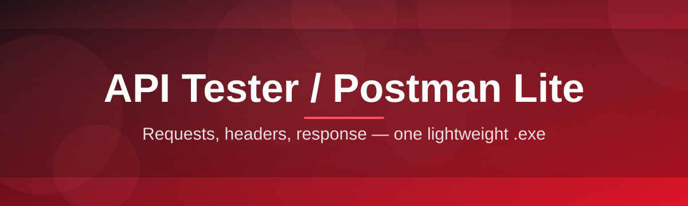
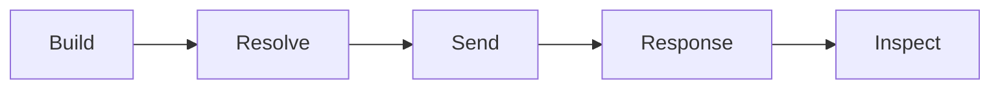

# api-tester-suite 🚀🧪

  

*A no-nonsense, standalone API workbench that fires requests, inspects responses, and gets out of your way.*

  

---

## 📡 Overview

`api-tester-suite` is a lightweight desktop workbench for people who talk to APIs all day and don't want to fight a bloated client to do it. It's an **API tester / Postman Lite** in the truest sense — request builder, response inspector, environment switcher, and history log, all packed into a single executable with zero setup ceremony. No account walls, no cloud sync you didn't ask for, no fifteen-second splash screen while it "syncs your workspace." You open it, you send a request, you see what came back.

This exists because most API clients today have drifted into territory that has nothing to do with testing APIs — team billing tiers, mandatory logins, telemetry you can't turn off. Meanwhile the actual job — build a request, hit send, read the response, repeat — got buried under three layers of navigation. `api-tester-suite` strips that back down. It's built for backend engineers, QA testers, indie devs shipping their own APIs, and anyone who needs a REST/HTTP client that behaves like a tool instead of a platform.

Under the hood it's a **Postman-lite** philosophy: cover the 90% of workflows — GET/POST/PUT/DELETE, headers, auth tokens, JSON bodies, query params, environment variables, and response diffing — without dragging in the 10% that turns a request tool into an enterprise SaaS product. If you've ever opened a heavyweight API client just to fire one quick request and waited ten seconds for it to boot, this tool was written specifically to make you never do that again.

> [!NOTE]
> The button above is the only official distribution point. There's no separate installer mirror, no package manager listing — one landing page, one download, no guesswork.

---

## ⚡ What It Actually Does

- **Instant request firing** — build a request and get a response back in the same breath; no request queue, no "sync before send" delay.

- **Environment-aware variables** — swap between `dev`, `staging`, and `prod` base URLs and tokens with one dropdown instead of editing every request by hand.

- **Response intelligence** — status code, timing, payload size, and formatted JSON/XML/HTML view all land in the same pane, color-coded so a 500 doesn't hide in a wall of text.

- **Collection history that remembers you** — every request you've sent is logged locally with timestamp and result, so you can replay a call from three days ago without rebuilding it.

- **Header & auth presets** — Bearer, Basic, API Key, and custom header sets save as reusable presets instead of copy-pasted strings.

- **Request chaining** — pipe a value from one response (say, a login token) straight into the next request's headers or body.

- **Diff view for regression checks** — compare today's response against a saved baseline to catch API drift before your users do.

- **Import/export in open formats** — collections save as portable JSON files you can version-control alongside your codebase.

> [!TIP]
> Pin your most-used requests to the sidebar with `Ctrl+D` — it turns a five-click workflow into a one-click one.

---

## 🏁 Getting Off the Ground

1. **Visit the landing page** using the download button above — that's the only source you need.

2. **Download the standalone build** — it's a single package, no bundled installer bloat.

3. **Run it directly** — double-click, no admin elevation, no background service installed.

4. **Build your first request** — pick a method, paste a URL, hit send. You're testing an API in under sixty seconds.

> [!IMPORTANT]
> This is a standalone Windows build. There is nothing to compile, nothing to configure via config files before first launch — it runs the moment you open it.

---

## 🖥️ System Requirements

| Requirement | Details |
|---|---|
| OS | Windows 10 or Windows 11 (64-bit) |
| Dependencies | None — fully standalone |
| Install footprint | Single portable executable |
| Internet | Only required for the API calls you make, not the tool itself |
| Admin rights | Not required |

  

---

## 🧠 How It Works

The flow is deliberately linear — build, send, inspect, decide. No hidden middleware, no request being silently rewritten before it leaves your machine.

1. You compose a request — method, URL, headers, body.

2. The engine resolves any environment variables inline.

3. The request is dispatched over standard HTTP/HTTPS.

4. The response streams back and gets parsed for display.

5. You inspect, save, or chain it into the next call.

> [!NOTE]
> Nothing is proxied through a third-party server. Requests go straight from your machine to the target API, which matters if you're testing against internal or staging environments behind a firewall.

---

## 🔧 Common Pitfalls

<strong>My request hangs and never returns a response.</strong>

Check that the target endpoint isn't behind a VPN or internal network you're not currently connected to. The app doesn't add its own timeout beyond what the API itself takes to respond, so a genuinely slow server will look like a hang.

<strong>Environment variables aren't resolving in my request.</strong>

Make sure the variable is wrapped in double curly braces, e.g. `{{baseUrl}}`, and that the correct environment is selected in the top-right dropdown — not just saved, but actively selected.

<strong>My auth token works in one request but not another.</strong>

Tokens attached via header presets are scoped per-collection by default. If you copied a request into a new collection, re-apply the preset — it doesn't follow the request automatically across collections.

<strong>The response body shows raw text instead of formatted JSON.</strong>

This happens when the response `Content-Type` header doesn't declare JSON. Force the view manually using the format toggle above the response pane.

<strong>History isn't showing older requests.</strong>

History is stored locally and capped by a rolling window to keep the app fast. Export important collections regularly if you need long-term archives.

> [!WARNING]
> Deleting a collection also deletes its saved environment variables and header presets — export before you clean house.

---

## 🎨 UI / UX Details

- **Themes**: Light, Dark, and a high-contrast mode for long debugging sessions.

- **Keyboard shortcuts**:

  | Action | Shortcut |
  |---|---|
  | Send request | `Ctrl+Enter` |
  | New request tab | `Ctrl+T` |
  | Pin request | `Ctrl+D` |
  | Toggle sidebar | `Ctrl+B` |
  | Switch environment | `Ctrl+E` |

- **Settings** persist locally — no cloud profile, no login wall.

- Response panes support **split view** so request and response sit side by side instead of stacked.

> [!TIP]
> Dark mode plus the high-contrast response coloring makes late-night debugging noticeably less punishing on the eyes.

---

## 🤝 Contributing & Community

This is a solo-shipped, actively maintained project — issues get triaged, not archived into a void. If you find a real bug, open an issue with a clear repro. If you want to propose a feature, describe the workflow it unblocks, not just the feature itself — that context matters more than a spec.

> Pull requests are welcome for bug fixes and small, well-scoped enhancements. Large architectural changes should start as a discussion first, so nobody's time gets wasted on a rewrite that won't land.

---

## 📄 License

Released under the [MIT License](LICENSE), 2026. Use it, fork it, ship it inside your own tooling — just keep the license notice intact.

---

## ⚖️ Disclaimer

`api-tester-suite` is provided as-is, without warranty of any kind, express or implied. It is a testing and development tool — you are responsible for the requests you send, the endpoints you target, and any data exchanged during use. The maintainer assumes no liability for misuse, data loss, or API-side consequences resulting from requests made through this tool.

